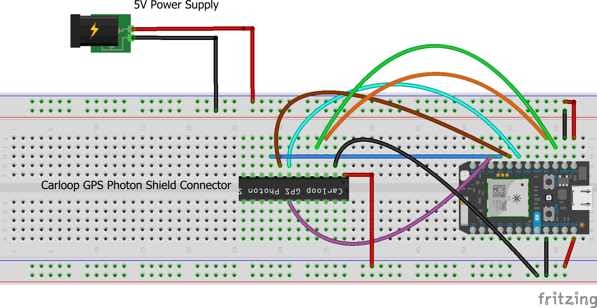
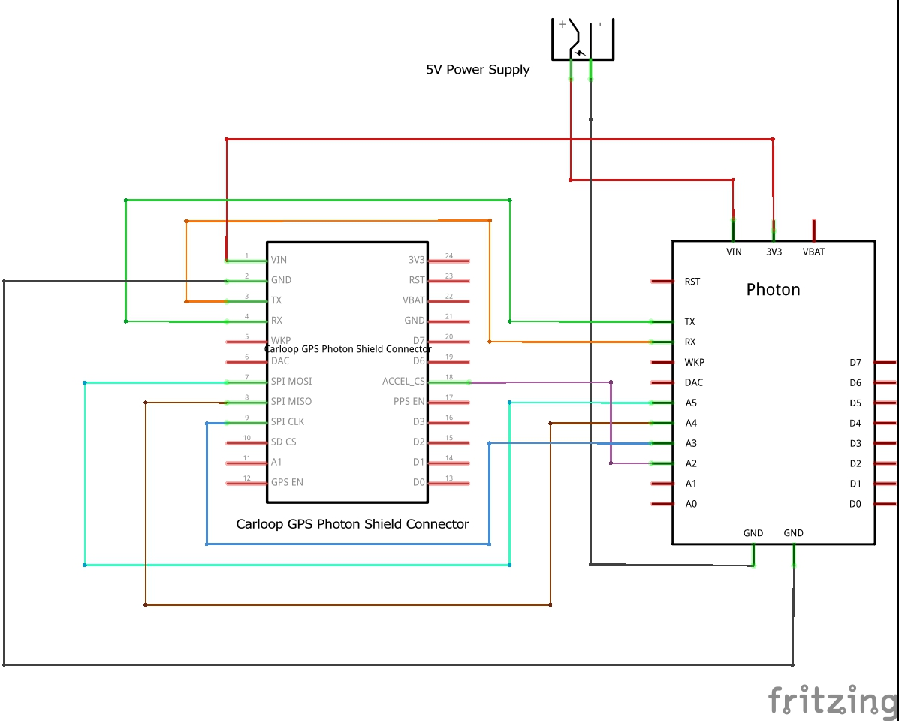
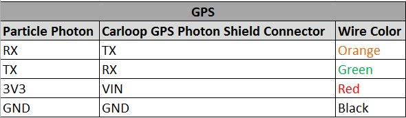
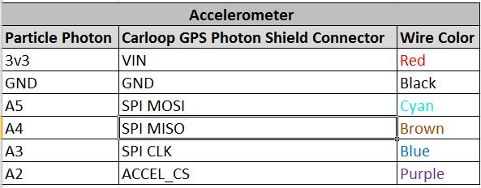

# Mechatronics Challenge

## Electrical

The wiring schematic of the challenge was drawn using the Fritzing program. The breadboard and schematic views of the wiring can be found below (Refer to Figure 1 and 2).

<b>Figure 1 </b> - Wiring Breadboard View 

<b>Figure 1 </b> - Wiring Schematic View

<b>GPS Connections</b>

The pin connections for the GPS module can be found in the table below (Refer to Table 1). The TX (serial transmit) pin of the Carloop GPS Photon Shield sends out the GPS data, which is then read by the RX (receive) pin of the microcontroller. In order to configure the GPS module, the RX pin of the shield module is connected to the TX pin of the microcontroller.  Lastly, based on the datasheet for the SAM-M8Q GPS module, the power supply voltage is 3.0V, which is supplied from the 3V3 pin of the Particle Photon microcontroller to the Vin pin of the shield. 

<b>Table 1 </b> - GPS Pin Connections

<b>Accelerometer Connections</b>

The pin connections for the accelerometer sensor can be found in the table below (Refer to Table 2). The LIS3DH library and datasheet heavily influenced many of the pin choices.  The accelerometer sensor, like the GPS module, uses a 3.0V power supply, thus utilizes the same Vin to 3V3 pin connection between the Carloop GPS Photon Shield and Particle Photon microcontroller, respectively.  The SPI interface was utilized in this pin set up. The ACCEL_CS (chip select) pin of the shield is connected to the A2 pin of the Particle Photon in order to drop it to LOW state for the SPI interface. By default, the pin is set to HIGH, which is the I2C interface set up. The SPI MOSI (Master Out Slave In) pin is connected to the A5 pin in order to allow data to be sent from the microcontroller to the sensor. The SPI MISO (Master In Slave Out) pin sends data from the sensor to the processor through the A4 pin. Lastly, The SPI CLK pin is connected to the A3 pin of the microcontroller

<b>Table 1 </b> - GPS Pin Connections

## Coding

For the code portion of this challenge, the LIS3DH and Carloop libraries were utilized in order to gather the necessary data. The code is split up in three sections:  initialization, loop, and methods. In the initialization section, the sensors and libraries are set up and the data rate is set for the serial data transmission. In the loop section, the methods that were written to log the data are being called on. The methods section contains multiple functions to gather data and to print them out in a legible fashion. The methods also check for valid data and logs whether or not the data is truly valid or missing on the console. The code examples from both the LIS3DH and Carloop libraries were used as templates. Refer to Appendix A for the code.

## Mechanical

The enclosure for the system can be found in Appendix B and C. The overall design was centered around the Carloop adapter with the Particle Photon and Carloop GPS module connected. There are two openings in the enclosure for the OBD-II connector and the USB Micro B connector. The opening for the USB connector allows for easy access for typical operations such as code changes, debugging, etc. Likewise, the opening for the OBD-II connector will also allow for operators/ developers to directly connect the module to a system such as test benches, vehicles, etc . The enclosure itself was also designed to be a snug fit to minimize the shifting of the modules within the box. (Refer to Appendix D) Lastly, the top cover is fastened onto the base enclosure using four allen bolts in the event that any of the modules will need to be replaced.  (Refer to Appendix E) For further design improvements, the enclosure could be modified with fasteners within the box to secure the components directly to the container to prevent any movements even further.  In addition, also note that the dimensions are subject to change due to not having the exact dimensions for the modules. 

## Appendix A - Mechatronics_Challenge Code

[Code](src/mechatronics_challenge.cpp)
